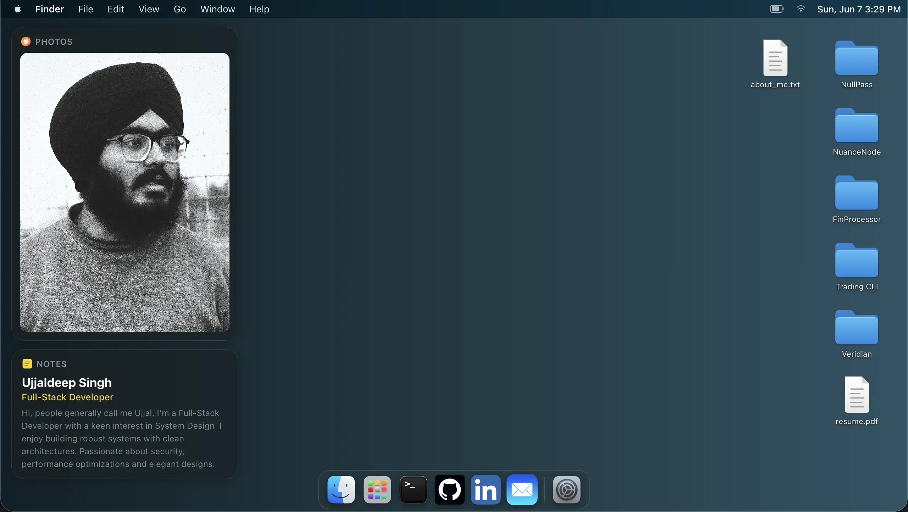

# 🍏 macOS Portfolio OS

Welcome to my interactive, web-based operating system portfolio! This project is a highly detailed, functional clone of the macOS desktop environment, built entirely from scratch using React and vanilla CSS. 

It serves as my personal developer portfolio, designed to showcase not just my projects, but my attention to detail, UI/UX skills, and frontend engineering capabilities.

 <!-- You can replace this with an actual screenshot of your desktop -->

---

## ✨ Key Features

This isn't just a static webpage; it's a fully interactive web application:

*   **🪟 Advanced Window Management:** Draggable, resizable, and maximizable windows just like a native OS.
*   **📱 Launchpad:** A full-screen, blurred iOS-style grid of applications with real-time search filtering.
*   **🔔 Notification Center:** Slide-in panel featuring:
    *   **Live Weather Widget:** IP-based precise location fetching via `ipinfo.io` and real-time weather via `Open-Meteo`.
    *   **Live GitHub Activity:** Fetches and displays my latest commits and pushes using the GitHub public API.
    *   **Quick Note:** A persistent scratchpad that saves data to `localStorage`.
*   **💻 Interactive Terminal:** A fully functional mock terminal with commands (`help`, `whoami`, `projects`, `clear`) and hidden easter eggs!
*   **📂 Finder & File System:** Browse through my actual projects as if they were directories, complete with `about_me.txt` and `resume.pdf` viewers.
*   **🖱️ Context Menu:** Custom right-click desktop menu to change wallpapers, reset layouts, and view system info.
*   **💾 Persistent State:** Your desktop icon positions, wallpaper choices, and notes are saved locally across sessions.
*   **🎨 Glassmorphism UI:** Heavy use of CSS `backdrop-filter` to replicate the premium Apple frosted glass aesthetics.

---

## 🛠️ Tech Stack

*   **Frontend Framework:** React 18
*   **Build Tool:** Vite
*   **Styling:** Vanilla CSS (CSS Variables, Flexbox, CSS Grid)
*   **Animations:** Framer Motion
*   **Data Fetching:** Native `fetch` API for GitHub and Weather data
*   **Deployment:** Vercel

---

## 🚀 Running Locally

Want to run this OS on your local machine? It's simple:

1.  **Clone the repository:**
    ```bash
    git clone https://github.com/sleepyUjjal/Portfolio-website.git
    cd Portfolio-website
    ```

2.  **Install dependencies:**
    ```bash
    npm install
    ```

3.  **Start the development server:**
    ```bash
    npm run dev
    ```

4.  **Open in your browser:**
    Navigate to `http://localhost:5173` to boot up the OS!

---

## 👨‍💻 About Me

Hi, I'm **Ujjaldeep Singh**, a Full-Stack Developer passionate about System Design, robust backend architectures, and creating interfaces that don't make people cry. 

If you like this project, feel free to drop a ⭐ on the repository, or reach out to me for collaboration!

*   **GitHub:** [@sleepyUjjal](https://github.com/sleepyUjjal)
*   **LinkedIn:** [Ujjaldeep Singh](https://www.linkedin.com/in/ujjaldeep)

---

<p align="center">
  <i>"Sorry, I wanted to write something myself." — Ujjal</i>
</p>
